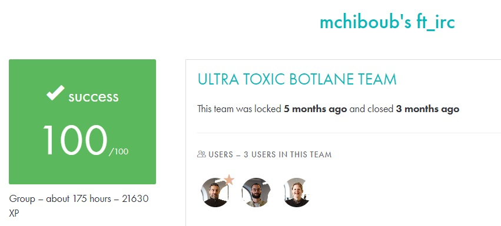

# FT_IRC #

## What the project does: ##
The ft_irc project involves creating an IRC (Internet Relay Chat) server in C++. It allows multiple clients to connect, set nicknames, join channels, and exchange messages in real-time. The server must support user authentication, private messaging, and operator commands like kicking users, setting channel topics, and controlling access.

## Why the project is useful: ##
This project is useful because it teaches the fundamentals of network programming, handling client-server communication using sockets, and implementing non-blocking I/O operations. These are crucial skills for developing scalable and real-time applications in C++ using TCP/IP, preparing you for building more complex networked systems.

[Subject of this project](en.subject.pdf)